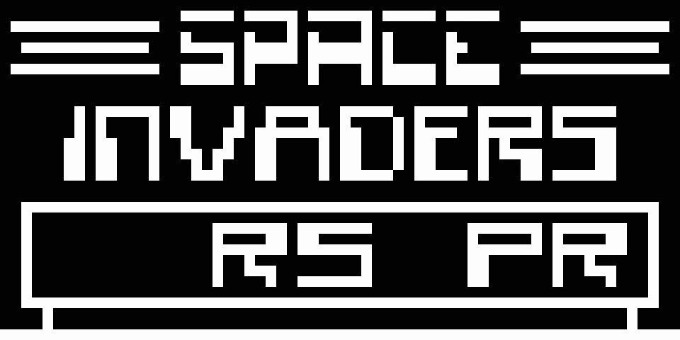

# Chip-8 Emulator
A basic Chip-8 emulator which implements the original 35 opcodes of the Chip-8 virtual machine. Uses SDL for graphics and is built using CMake.

# Example Video

# TODO
<ul>
<li>Implement additional Super Chip-8 opcodes
<li>Increase accuracy of clock speed</li>
<li>Implement sound</li>
<li>Improve error handling</li>
</ul>
